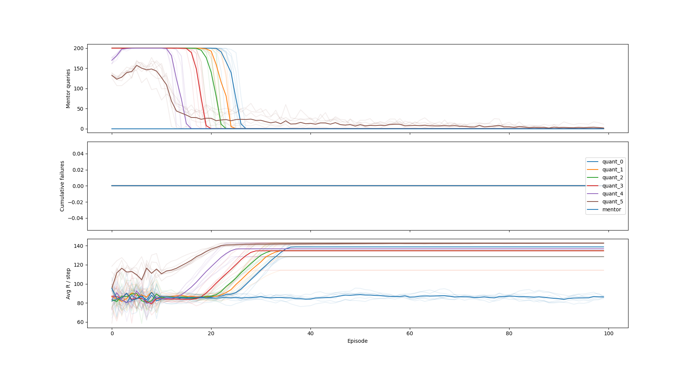

# Distributed Q Learning - QuEUE

Algorithm specification pending.

## Setup

```bash
# Setup conda envs
cd .. && conda env create -f latest_env.yml && cd dist_q_learning

# set python path to current dir
source set_path.sh

# see all possible arguments
python main.py -h
```

## Q Table implementation

Implements a finite state experiment.

Goal: implement QuEUE faithfully, demonstrate properties of a pessimistic agent in an intuitive case.

### Example

```bash
python main.py --agent pess --quantile 4 --mentor random_safe --trans 1 --n-steps 100000 --render 1
```
All arguments are specified in `main.py`. In Experiment, we explain the core experiment and relevant code.

- `--agent pess` - pessimistic agent (see Experiment, below)
- `--quantile 4` - use the 4th index of QUANTILES (as in `main.py`)
- `--mentor random_safe` - use the mentor that provides a random, safe action
- `--trans 1` - use the 1-indexed transition function (see sepcification in `main.py`)
- `--n-steps 100000` - train for 100k steps. Default report period of 500.
- `--render 1` - rendering verbosity 1 of (0, 1, 2)

### Environment

We implement a simple cliffworld environment, in `env.py`.
```
-1 -1 -1 -1 -1 -1 -1
-1  0  0  0  0  0 -1
-1  0  0  0  0  0 -1
-1  0  2  0  0  0 -1
-1  0  0  0  0  0 -1
-1  0  0  0  0  0 -1
-1 -1 -1 -1 -1 -1 -1
```
Grid spaces:
- `-1`: a cliff state (0 reward, ends episode)
- `2`: the agent position
- `0`: a grid space that can has various effects, determined by `transition_defs.py`

#### Environment configurations

There are a few environments available:

- `0`: constant reward everywhere (default 0.7)
- `1`: Each state has a normal-distribution over rewards, with mean reward sloping up linearly left to right
- `2`: Each state has a constant reward, with reward sloping up linearly left to right

When the `--mentor avoid_teleport` configuration is used, there is a state where the agent can be teleported to a bad state, with low likelihood. That is wrapped over whatever environment you use.

### Experiment

The agent implementing the finite state case of the QuEUE algorithm is `agents.PessimisticAgent`. It uses the `estimators.QuantileQEstimator` and `estimators.ImmediateRewardEstimator` to make pessimistic updates and estimates of the Q value for a state-action pair.

### Demonstration of pessimistic properties

We demonstrate properties of a pessimistic agent in the finite case:

- Mentor queries -> 0
- Performance >(=) mentor performance
- Unprecendented event (episode-ending failure) never happens

```bash
python experiments/core_experiment/finite_agent_0.py
```



### Proving epistemic uncertainty matters

```bash
python experiments/teleporter/exp_main.py
```

## Function approximators - Deep Q learning

### Gated linear networks

Using Deepmind implementation:

`https://github.com/deepmind/deepmind-research/tree/master/gated_linear_networks`

In `gated_linear_networks`, as this git repo does not have pip install support, yet.

## Testing

```bash
python -m unittest discover tests
```
