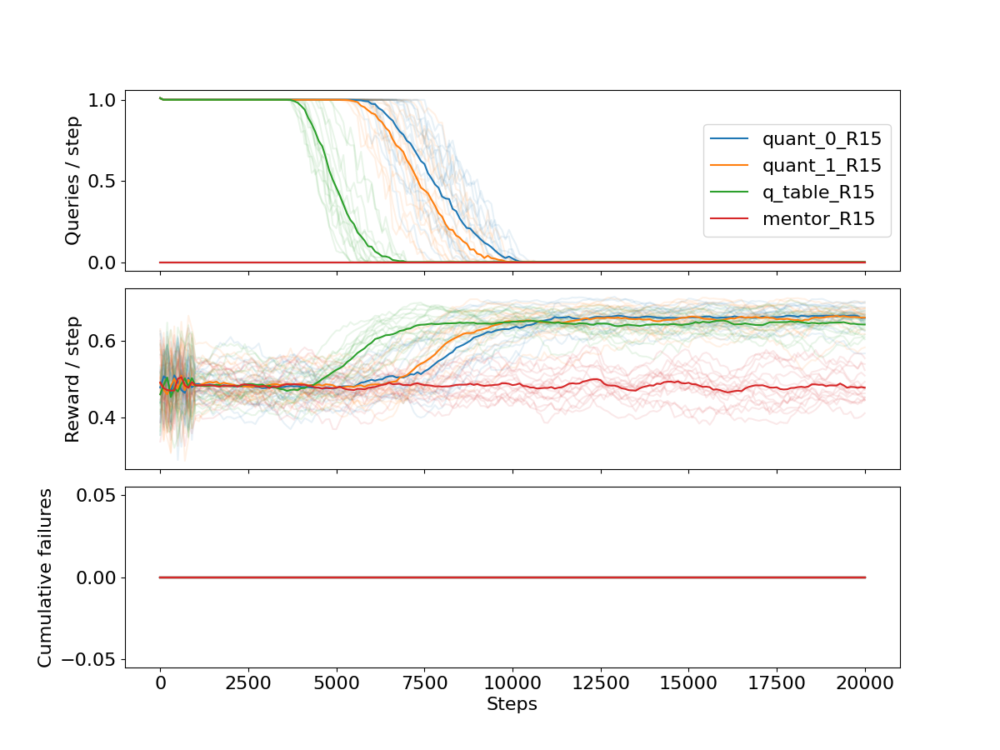
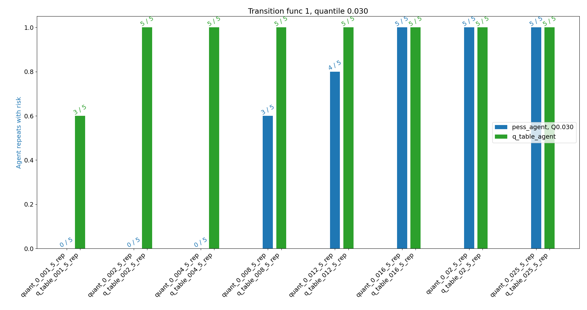
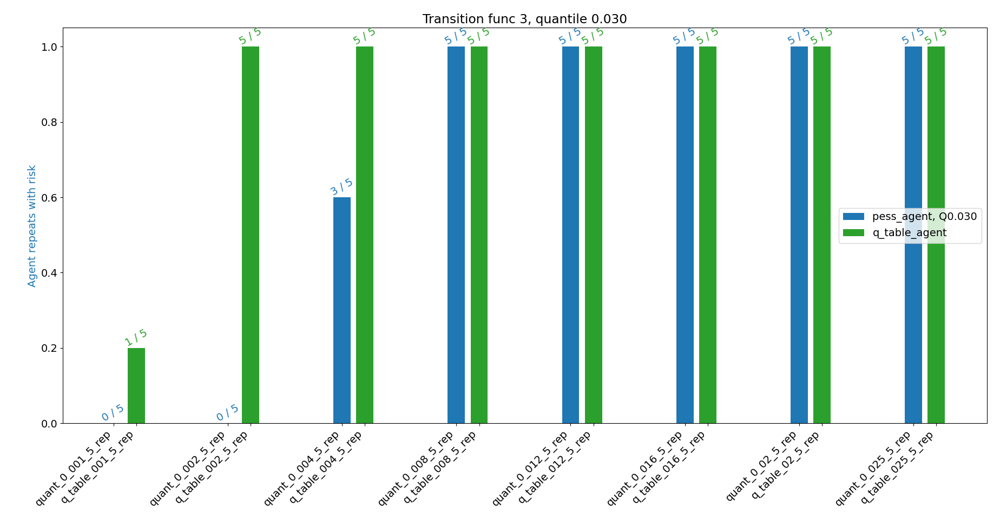

# Distributional Q Learning

We introduce an algorithm that, instead of learning the expectation value for Q,
keeps a distribution over Q values. With a distribution over Q values we approximate an ordering
over world models, and can select a low quantile to demonstrate behaviour of pessimistic agents.

The distribution is taken over epistemic uncertainty, induced by e.g. lack of observations
in a certain area of the environment.

The Distributional Q Learning algorithm is defined in `agents.PessimisticAgent`,
which utilises two estimators to make pessimistic updates and estimates to the Q value
for a history of state, action pairs:
- `q_estimators.QuantileQEstimator`
- `estimators.ImmediateRewardEstimator`

# Setup

## Environment

`cd conda_envs/`

### CPU (basic) setup

A conda environment for CPU is available.
```bash
conda env create -f cpu_env.yml
conda activate cpu_env
```

### GPU setup

First install the relevant version of
[cuda](https://docs.nvidia.com/cuda/cuda-installation-guide-linux/index.html)
and [cuDNN](https://docs.nvidia.com/deeplearning/cudnn/install-guide/index.html) for your machine.


There is an environment compatible with Cuda Toolkit >= 11.1, cudnn >= 8.1,
but this is expected to be less reliable than CPU.
```bash
conda env create -f cuda111.yml
conda activate cuda111
```

Else, execute the following for a manual installation:

```bash
conda env create -f cpu_env.yml -n cuda
conda activate cuda
conda uninstall pytorch cpuonly
# See below
```
Then follow:
- Pytorch [docs](https://pytorch.org/get-started/locally/)
- Jax [docs](https://github.com/google/jax#installation) (and see note below)

Test with: `cd .. && python tests/check_gpu.py`

### Jax versions
Important: DeepMind's GLN implementations require specific versions of Jax.

Use the following instead (defaulting to highest version of cuda <= your version, found with `nvcc -V`):

```
jax==0.2.0
jaxlib==0.1.55+cuda110
```

An [open issue](https://github.com/google/jax/issues/6932) may mean you need to try `jaxlib==0.1.55+cuda111`; I found this to work.

## Setup paths

```bash
# set python path to current dir
source set_path.sh

# Check operation and see all possible arguments
python main.py -h
```

### Example run

```bash
# display the help message
python main.py -h

# Run a basic pessimistic agent in a stochastic-reward environment
python main.py --agent pess --quantile 4 --mentor random_safe --trans 1 --n-steps 100000 --render 1
```
All arguments are specified in `main.py`.

- `--agent pess` - pessimistic agent (see Experiment, below)
- `--quantile 4` - use the 4th index of QUANTILES (as in `main.py`)
- `--mentor random_safe` - use the mentor that provides a random, safe action
- `--trans 1` - use the 1-indexed transition function (see sepcification in `main.py`)
- `--n-steps 100000` - train for 100k steps. Default report period of 500.
- `--render 1` - rendering verbosity 1 of (0, 1, 2)

#  Q Table implementation

Implements a finite state experiment.

Goal: implement QuEUE faithfully, demonstrate properties of a pessimistic agent in an intuitive case.


## Environment details

We implement a simple cliffworld environment, in `env.py`.
We have a safe zone (`0`) surrounded by 'cliffs' that provide zero reward forever (`-1`).
The agent (`2`) moves in the safe zone.
```
-1 -1 -1 -1 -1 -1 -1
-1  0  0  0  0  0 -1
-1  0  0  0  0  0 -1
-1  0  2  0  0  0 -1
-1  0  0  0  0  0 -1
-1  0  0  0  0  0 -1
-1 -1 -1 -1 -1 -1 -1
```

### Configurations

There are a few environments available, with the `--trans n` argument:

- `0`) Test env, constant reward everywhere (default 0.7)
- `1`) Normally-distributed rewards, mean reward sloping up linearly, left to right.
- `2`) Constant reward, mean reward sloping up linearly, left to right.
- `3`) As 1, but stochastic transitions with 60% probability of the deterministic next-state.
  Other transitions are randomly distributed. Note, the agent is never stochastically thrown over the cliff:
  it must positively take that action, to fail.
  
### Wrappers

With the `--wrapper WRAPPER` argument, interesting features can be added. For example, when either of the two are added,
every state has one 1 action where the scores zero reward forever, with low likelihood (1% default).

- `every_state` - rewards remain in tact.
- `every_state_boost` - reward = 1. for the risky action, i.e. incentivising it.

## Mentors

Different mentors are available with `--mentor MENTOR`. The most interesting are:

- `random_safe` - the agent takes random actions that do not put the agent into a cliff state. This is useful for
  mimicking exploration, without implementing an informed mentor.
- `avoid_state_act` - when used with the wrappers (see above), the mentor is aware of the risky states and avoids them,
  though a small probability of taking them remains (default, 1%). Otherwise as above.

## Experiments

## Demonstration of pessimistic properties

We demonstrate properties of a pessimistic agent in the finite case:

- Mentor queries -> 0
- Performance >(=) mentor performance
- Unprecendented event (episode-ending failure) never happens

```bash
python experiments/core_experiment/finite_agent_0.py
```

### Fully stochastic environment



We observe that Distributional Q learning algorithms demonstrate the properties of a Pessimistic Agent.

Plotted, are the 1st and 2nd quantiles (3rd and 6th percentile). Higher percentiles also demonstrate the property,
but are omitted for clear expression. They are plotted against: an unbiased Q learning agent, meaning it simply learns
the expectation value of Q as normal; an agent that that follows the mentor forever.

None of the agents ever step onto a cliff state, including the unbiased Q learning agent. To prove the
safety result, we consider another environment.

## Proving epistemic uncertainty matters

Using the `--wrapper every_state` setup (see above), we introduce a risky state-action, which the mentor is aware of
and takes less frequently (e.g. it doesn't completely avoid risk as it has imperfect knowledge).

We plot the proportion of repeat experiments - over 50k timesteps - where the _agent_ took the risky action even once.
The x-axis represents mentor risk-taking frequency, e.g.:

`quant_0_001_5_rep` ->

- `quant_0` = the 1st quantile (3%) of  the pessimitic agent
- `001` = mentor took risky action with frequency 0.01 (1%) during demonstrations
- `5_rep` = 5 repeat experiments constituted this datapoint.

```bash
python experiments/event_experiment/exp_main.py
```

### Stochastic reward


We demonstrate that the unbiased Q learner is more eager to take the risky action, after it being demonstrated rarely.
A pessimistic agent needs more reassurance before it is willing to take risks on rarely demonstrated maneuvers.

When the state is continuous, a pessimistic agent should, for example, avoid regions that have not been favoured by
the mentor. In future work, we will show that this result generalises to function approximators.

### Fully stochastic


In the fully stochastic environment, the pessimistic agent starts taking the risky action at a lower
frequency of risky demonstrations. We observe the stochastic agent explores the grid more fully, so perhaps when the
agent is better informed about the whole environment, epistemic uncertainty reduces (due to the way we approximate the
transition uncertainty).

---
#  Function approximators - Deep Q learning

### Gated linear networks

Using Deepmind implementation:

`https://github.com/deepmind/deepmind-research/tree/master/gated_linear_networks`

In `gated_linear_networks`, as this git repo does not have pip install support, yet.

---
# Tests

```bash
python -m unittest discover tests
```
